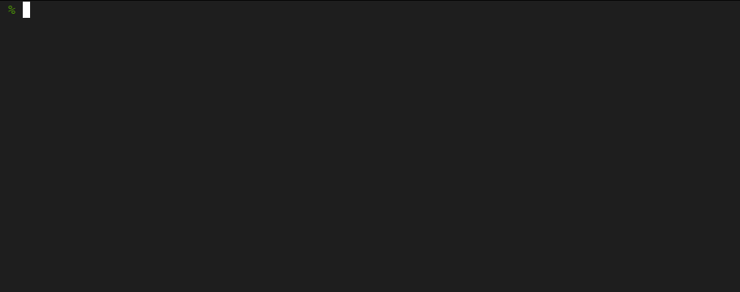

# Which Alias To...?

[](LICENSE) [](https://github.com/RichardLitt/standard-readme)

How much time did you spend crafting and perfecting that nifty alias that you thought you would use often enough to remember its name, but that in fact you can't quite pinpoint when you most need it?

Inspired by and relying on [fzf](https://github.com/junegunn/fzf), enter `wat`: _Which Alias To...?_




---

- [Install](#install)
  - [Prerequisites](#prerequisites)
  - [Shell integration](#shell-integration)
- [Usage](#usage)
  - [Documenting your aliases](#documenting-your-aliases)
  - [Searching for aliases](#searching-for-aliases)
- [Limitations](#limitations)

---

## Install

### Prerequisites

You need to have [`fzf`](https://github.com/junegunn/fzf#installation) installed on your system and in your PATH.

### Shell integration

1. Clone this repo somewhere memorable.
2. Build the `wat` binary either manually (`go build`) or through the [just](https://github.com/casey/just) task runner.
   + With **Docker**: `just docker`
   + With your local Go toolchain: `just go`
3. Source the hooks script in your `~/.zshrc`:
    ```bash
    (cat << EOF

    # Source alias search hooks
    # https://github.com/nmaggioni/wat
    source $(readlink -f .)/wat.zsh

    EOF
    ) | tee -a ~/.zshrc
    ```

## Usage

### Documenting your aliases

Document your aliases directly in your `~/.zshrc` using `#d:` to prefix descriptions and `#t:` to prefix comma-delimited tags.

```bash
alias zshconfig="vim ~/.zshrc && exec zsh" #d: edit and reload the shell config #t: edit,vim,zsh,rc,config
```

Only the **tags field is mandatory**, and spaces after `#d:` and `#t:` are optional.

### Searching for aliases

Hit **CTRL+A** in your terminal to trigger an alias search.

Type to search by name, description or tag. Use the arrow keys to move, and hit ENTER to insert the selected alias in place.

## Limitations

Aliases are only loaded from your main shell configuration file.

The shell config file is read in its entirety every time a search is started.

Alias names must not contain colons (`:`).

ZSH is the only currently supported shell.

| Shell | Supported | Notes |
| --- | --- | --- |
| ZSH | Yes | |
| Bash | No | TBD |
| Fish | No | TBD |
